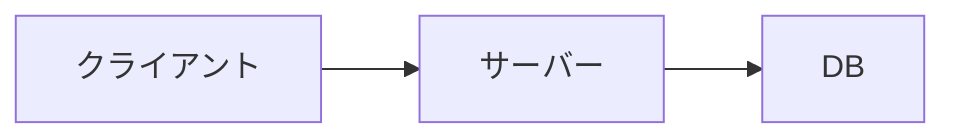
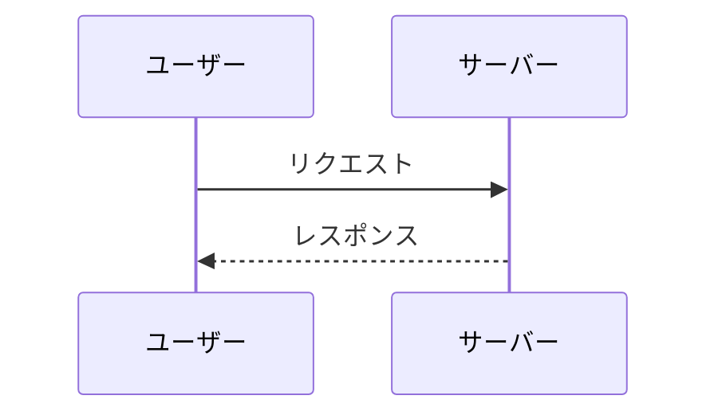
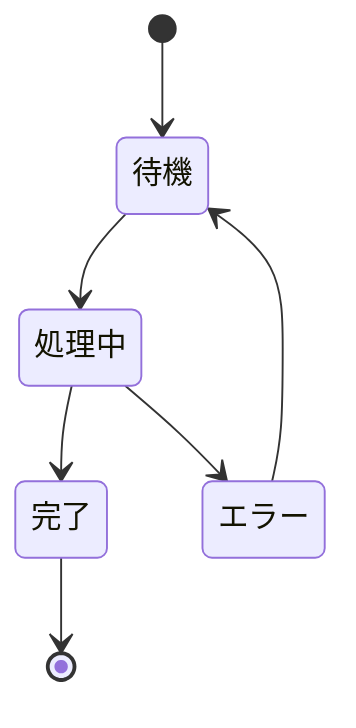

# Mermaid図の選び方ガイド

## 図の種類と使い分け

### flowchart（フローチャート）

一番使う図。構成・フロー・分岐の可視化。



**方向の選び方:**

| 方向 | 用途 | 例 |
|------|------|-----|
| `LR`（左→右） | 横並びの構成・パイプライン | A→B→C→D |
| `TD`（上→下） | 階層・深いフロー | レイヤー図、判断ツリー |
| `RL`（右→左） | ほぼ使わない | — |

**装飾:**

- `A[四角]` — 通常ノード
- `B{ひし形}` — 条件分岐
- `C([丸角)]` — 開始・終了
- `D[[二重四角]]` — サブルーチン
- `style A fill:#e1f5fe` — 色付け

### sequenceDiagram（シーケンス図）

API呼び出し・メッセージ交換の時系列。



**使い所:** API呼び出し、認証フロー、Webhook、決済フロー

### stateDiagram-v2（状態遷移図）

状態の変化を表現。



**使い所:** タスク管理、ライフサイクル、状態マシン

## Zennでの注意点

1. `` ```mermaid `` で囲む（言語指定なしはNG）
2. 日本語ラベルOK（Zennは日本語を正しくレンダリング）
3. ノード数は5〜12個が最適（多すぎると見にくい）
4. `subgraph` でグループ化すると情報整理しやすい
5. 色は `style` で指定（Zennはダークモード対応）

## 入れるべき・入れるべきでない判断

### 入れるべき

- アーキテクチャ図（3コンポーネント以上の関係）
- 処理フロー（分岐がある）
- 複数システム間のやり取り
- 状態遷移（4状態以上）

### 入れないでよい

- 2要素の関係（→で十分）
- テーブルで済む比較
- 箇条書きで済む手順
- コード例で十分な説明
